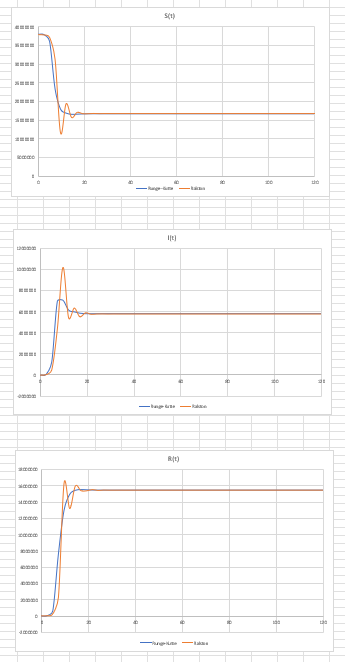
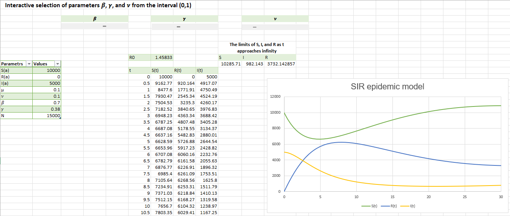

# SIR epidemic model

The SIR model is a simple epidemiological model described by ordinary differential equations (the parameters and equations are found in the SIR.xlsm file in the Introduction sheet). The project visualizes numerical solutions of this system of equations depending on the initial conditions, which the user can modify. Additionally, it includes an interactive report enabling tracking of the impact of the basic reproduction number on the development of the pandemic.

## Inspiration

The project was a student assignment that we worked on as a part of an MS Excel course. It combined theoretical knowledge with the use of available tools for implementing mathematical problems.

## How to open the file?

You need to download the file and open with Microsoft Excel, then you will be able to use it without any limitations.

## Technologies

The entire project was done in Microsoft Excel using VBA (Visual Basic for Applications).

## Numerical solving of systems of differential equations

Two numerical methods have been implemented: the third-order Runge-Kutta method and the Ralston method. Additionally, the solutions have been visualized on plots. Below is a comparison of both methods for the same parameters:

## Interactive Report

An interactive report has been created where you can modify the parameters β, γ, ν to track the development of the pandemic

The full report(in the Polish language version), containing a detailed mathematical description of the problem as well as examples, is located in the file REPORT.pdf.
